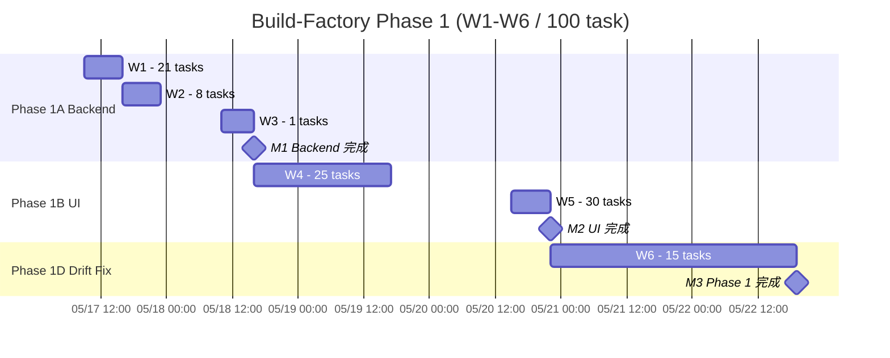

# Build-Factory Phase 1 Schedule (v3 wave-schedule)

> 2026-05-16 generated by `_generate.py`. 上流: `docs/task-decomposition/2026-05-16_v3_phase1/tickets-group-*.json` (100 task)
> 下流: `distributed-dev` (Wave 起動順序) / `claude-runner` (parallel session orchestration) / `integration` (Wave 完了集計) / `delivery` (M1-M3 milestone)

## Summary

- **Total task**: 100 (30 backend + 25 UI part1 + 30 UI part2 + 15 drift)
- **Wave count**: 6 (W1-W6) / **Sub-wave**: 18 (mutex-aware)
- **Parallel capacity**: 30 Claude Code sessions
- **Elapsed time (parallel)**: ~91h working + 6h CI buffer = **~97h** (≈ 7.5 営業日 / 営業時間 09:00-22:00 = 13h/day)
- **Phase 1 start**: 2026-05-17 09:00 JST
- **Phase 1 end (M3)**: 2026-05-24T15:00:00+09:00
- **Milestones**: M1 (Backend 完成) / M2 (UI 完成) / M3 (Phase 1 完成 / dogfood ready)

## Wave Overview

| Wave | Phase | Layer | Tasks | 並列 | Duration | Sub-wave | Group | depends_on | exit |
|---|---|---|---|---|---|---|---|---|---|
| **W1** | P1A | backend | 21 | 21 | 6h (+1h CI) | 1 | B=21 | - | all 21 tasks auto-merged + CI gates green |
| **W2** | P1A | backend | 8  | 8  | 6h (+1h CI) | 1 | B=8  | W1 | all 8 tasks auto-merged + CI gates green |
| **W3** | P1A | backend | 1  | 1  | 5h (+1h CI) | 1 | B=1  | W2 | all 1 tasks auto-merged + CI gates green |
| **W4** | P1B | ui      | 25 | 25 | 24h (+1h CI)| 5 | C=25 | W3 | all 25 tasks auto-merged + CI gates green |
| **W5** | P1B | ui      | 30 | 30 | 6h (+1h CI) | 1 | C=30 | W4 | all 30 tasks auto-merged + CI gates green |
| **W6** | P1D | polish  | 15 | 15 | 44h (+1h CI)| 9 | D=15 | W5 | all 15 tasks auto-merged + CI gates green |

## Gantt (Mermaid)



## Gantt (Markdown ASCII table)

各セルは Wave 占有時間帯 (1 セル = 4h block, JST)。

| Day | 09-13 | 13-17 | 17-21 | 21-翌09 |
|---|---|---|---|---|
| 05/17 | W1 | W1,W2 | W2 | W2 |
| 05/18 | W2,W3 | W3,W4 | W4 | W4 |
| 05/19 | W4 | W4 | W4 | W4 |
| 05/20 | W4 | W4,W5 | W5 | W5,W6 |
| 05/21 | W6 | W6 | W6 | W6 |
| 05/22 | W6 | W6 | W6 | W6 |
| 05/23 | W6 | W6 | W6 | W6 |
| 05/24 | W6 | W6 | - | - |

## 各 Wave 詳細

### W1 — Backend Wave 1 — auth/workspace/profile/account/admin/RBAC + 17 backend layers (21 並列)

- **Phase**: P1A / **layer**: backend
- **Start**: 2026-05-17T09:00:00+09:00
- **End**:   2026-05-17T16:00:00+09:00
- **並列度**: 21 sessions (capacity 30)
- **Task 数**: 21
- **Duration**: 6h + 1h CI buffer
- **Total estimate (合計工数)**: 103.9h
- **依存 Wave**: (none / 起動可能)
- **Category**: backend=21
- **Sub-wave 数**: 1 (no mutex conflict / parallel 起動可能)

**Tasks** (head 5 + tail 2): T-V3-B-01, T-V3-B-03, T-V3-B-04, T-V3-B-05, T-V3-B-07 ... T-V3-B-29, T-V3-B-30

**Completion criteria:**
- all tasks auto-merged via 8 CI gate pipeline
- contract test (Schemathesis) green for all touched endpoints
- RLS coverage (verify-rls-coverage.py) 100%
- pytest cov >= 70% (delta) on backend/app/
- pyright strict 0 errors
- audit MD existence check pass (audit-md-check.sh)

### W2 — Backend Wave 2 — auth-deps + invitation/mock/task/session/AI (8 並列 / depends W1)

- **Phase**: P1A / **layer**: backend
- **Start**: 2026-05-17T16:00:00+09:00
- **End**:   2026-05-18T10:00:00+09:00
- **並列度**: 8 sessions (capacity 30)
- **Task 数**: 8
- **Duration**: 6h + 1h CI buffer
- **Total estimate**: 40.1h
- **依存 Wave**: W1
- **Sub-wave 数**: 1

**Tasks**: T-V3-B-02, T-V3-B-06, T-V3-B-09, T-V3-B-12, T-V3-B-16 ... T-V3-B-20, T-V3-B-25

### W3 — Backend Wave 3 — phase orchestration final (1 task / depends W2)

- **Phase**: P1A / **layer**: backend
- **Start**: 2026-05-18T10:00:00+09:00
- **End**:   2026-05-18T16:00:00+09:00
- **Task 数**: 1 (T-V3-B-21) / **Duration**: 5h + 1h CI / **依存 Wave**: W2

### W4 — UI Part 1 — auth/account/AI/client/email/export (25 並列 / depends W1-W3)

- **Phase**: P1B / **layer**: ui
- **Start**: 2026-05-18T16:00:00+09:00
- **End**:   2026-05-20T15:00:00+09:00
- **並列度**: 25 sessions (capacity 30)
- **Task 数**: 25 / **Duration**: 24h + 1h CI / **依存 Wave**: W3
- **Sub-wave 数**: **5** (file mutex に基づき分割 / sub-wave 順に直列起動、各 sub-wave 内では parallel)

**Sub-wave 詳細**:

| Sub-wave | Tasks | 並列 |
|---|---|---|
| W4.a | T-V3-C-01, T-V3-C-06, T-V3-C-07, T-V3-C-09, T-V3-C-10, T-V3-C-14... | 10 |
| W4.b | T-V3-C-02, T-V3-C-08, T-V3-C-11, T-V3-C-12, T-V3-C-16, T-V3-C-18... | 7 |
| W4.c | T-V3-C-03, T-V3-C-13, T-V3-C-19, T-V3-C-24 | 4 |
| W4.d | T-V3-C-04, T-V3-C-20 | 2 |
| W4.e | T-V3-C-05, T-V3-C-21 | 2 |

**Completion criteria:**
- all tasks auto-merged via 8 CI gate pipeline
- mock-impl-diff (lint #17) 0 件 for touched screens
- tsc strict 0 errors / a11y check pass (axe-core)
- TanStack Query integration smoke test green
- audit MD existence check pass

### W5 — UI Part 2 — mocks/feature/screens/tasks/sessions (30 並列 / depends W1-W3)

- **Phase**: P1B / **layer**: ui
- **Start**: 2026-05-20T15:00:00+09:00 / **End**: 2026-05-20T22:00:00+09:00
- **並列度**: 30 / **Task 数**: 30 / **Duration**: 6h + 1h CI / **依存 Wave**: W4
- **Sub-wave 数**: 1

**Tasks**: T-V3-C-37〜T-V3-C-64 (30 件)

### W6 — Drift Fix — Group D entity/api/screen drift (15 並列 / depends W1-W5)

- **Phase**: P1D / **layer**: polish
- **Start**: 2026-05-20T22:00:00+09:00 / **End**: 2026-05-24T15:00:00+09:00
- **並列度**: 15 / **Task 数**: 15 / **Duration**: 44h + 1h CI / **依存 Wave**: W5
- **Sub-wave 数**: **9** (entities.json 9 task 共有 + migration chain forbidden により細分化)

**Sub-wave 詳細**:

| Sub-wave | Tasks | 並列 |
|---|---|---|
| W6.a | T-V3-D-01, T-V3-D-04, T-V3-D-09, T-V3-D-10, T-V3-D-11, T-V3-D-15 | 6 |
| W6.b | T-V3-D-02, T-V3-D-03 | 2 |
| W6.c | T-V3-D-05 | 1 |
| W6.d | T-V3-D-06 | 1 |
| W6.e | T-V3-D-07 | 1 |
| W6.f | T-V3-D-08 | 1 |
| W6.g | T-V3-D-12 | 1 |
| W6.h | T-V3-D-13 | 1 |
| W6.i | T-V3-D-14 | 1 |

**Completion criteria:**
- all 15 drift fix tasks auto-merged
- lint #17 (mock-impl-diff) / #18 (screens-API) / #19 (entity-table-naming) 0 件
- entity drift list -> 0 entries in inventory
- API method mismatch (HEAD/lint) 0 件 / screen drift (H1/KPI) 0 件

## マイルストーン

| ID | Name | After Wave | Date | Exit Criteria |
|---|---|---|---|---|
| **M1** | Phase 1A Backend 完成 | W3 | 2026-05-18T16:00:00+09:00 | 30 backend tasks merged / 94 endpoint contract tests green / RLS coverage 100% / no critical drift |
| **M2** | Phase 1B UI 完成 | W5 | 2026-05-20T22:00:00+09:00 | 55 UI tasks merged / mock-impl-diff (lint #17) 0 件 / a11y check pass / screens.json と route 一致 (lint #18) |
| **M3** | Phase 1 完成 (dogfood ready) | W6 | 2026-05-24T15:00:00+09:00 | 100 tasks merged / drift fix 完了 / 8 CI gate all green / dogfood 起動可能 |

## Critical Path

最短納品経路 (auth slice → UI → drift fix → final validation):

```
  T-V3-B-01 → T-V3-B-02 → T-V3-C-01 → T-V3-C-02 → T-V3-D-01 → T-V3-D-15
```

## CI Gate Auto-merge (8 gate)

1. `lint-mock` (19 checks)
2. AC validator (validate-tickets.py / 3-tier schema + EARS form)
3. RLS coverage (verify-rls-coverage.py)
4. audit MD existence (audit-md-check.sh)
5. pytest cov >= 70% (delta)
6. pyright strict
7. tsc strict
8. mock-impl-diff (lint-mock-impl-diff.py / lint #17)

- **連続失敗閾値**: 3
- **Retry protocol**: 1st fail = auto-retry / 2nd fail = enrich audit MD / 3rd fail = human (high.takamoto@engine-base.com)

## 失敗時 retry プロトコル

```
CI gate fail
  ↓
1st fail → auto-retry (CI 再実行 / max 30 min)
  ↓ fail again
2nd fail → audit MD に失敗原因を enrich (lint output / test diff / coverage delta)
           → Claude Code session 再起動 (audit MD コンテキスト保持)
  ↓ fail again
3rd fail → human エスカ (high.takamoto@engine-base.com + Slack)
           → Wave 停止 / Phase gate 凍結
```

**Wave-level rollback**:
- 単一 task: PR revert + drift fix queue (W6) に追加
- Wave 全体: 該当 Wave の全 PR revert + 次 Wave 起動を凍結 → human 判断
- `git reset --hard` は禁止 (commit 履歴保全)

## File mutex 検証

```bash
# 各 sub-wave 起動前に必ず実行
for sw in W1.a W2.a W3.a W4.a W4.b W4.c W4.d W4.e W5.a \
          W6.a W6.b W6.c W6.d W6.e W6.f W6.g W6.h W6.i; do
  python3 scripts/check-wave-mutex.py \
    --tickets docs/schedule-design/2026-05-16_v3_phase1/wave-tickets.json \
    --wave $sw --strict || exit 1
done
```

**現状**: 18 sub-wave 全て --strict PASS 確認済 (2026-05-16 generation time)。

## リスク (Phase 1 schedule 視点)

| ID | リスク | 確率 | 対応 |
|---|---|---|---|
| R-V3-01 | CI gate 連続失敗 (1 task / 3+ 回 reject) | 中 | 3 回で human エスカ + audit MD で原因記録 (SD-06) |
| R-V3-02 | 並列セッション競合 (同一 file への並列 edit) | 中 | check-wave-mutex.py で 18 sub-wave 起動前に検証 (SD-08) |
| R-V3-03 | drift 増殖 (Group D 滞留) | 高 | W6 で 15 task 並列実行 + lint #17-19 0 件を M3 exit criteria に組込み |
| R-V3-04 | Foundation gate 未達のまま Backend phase 開始 | 低 | Phase 0 完了済前提 (docs/task-decomposition/2026-05-16_v3_phase0/) |
| R-V3-05 | GitHub Actions 並列上限超過 | 中 | parallel_capacity = 30 で固定 (SD-02) |
| R-V3-06 | UI phase が Backend API spec 変更で手戻り | 中 | Backend phase (W1-W3) 完了 → M1 → UI phase 起動の順序保証 (SD-01) |

## Open Questions

- Q1: Group C ticket の depends_on (T-V3-B-001 3-digit 形式) を正規化するタイミング → 推奨: 次回 task-decomp PR で正規化
- Q2: Group D の depends_on が空欄 (notes: 上位コーディネータが wave 4 をブロックして直列化) → 本 schedule では W1-W5 完了を depends_on_waves で機械的に block

---

**Generated**: 2026-05-16 by schedule-design v3 / build-factory profile
**Responsible**: 高本まさと (masato@engine-base.com)
