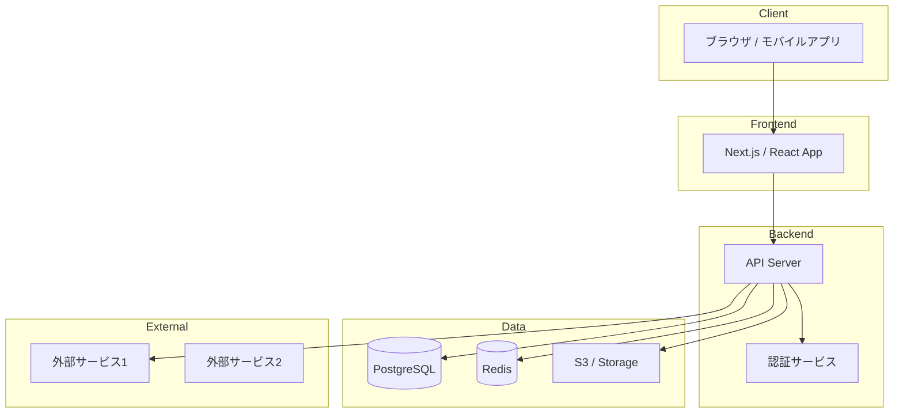
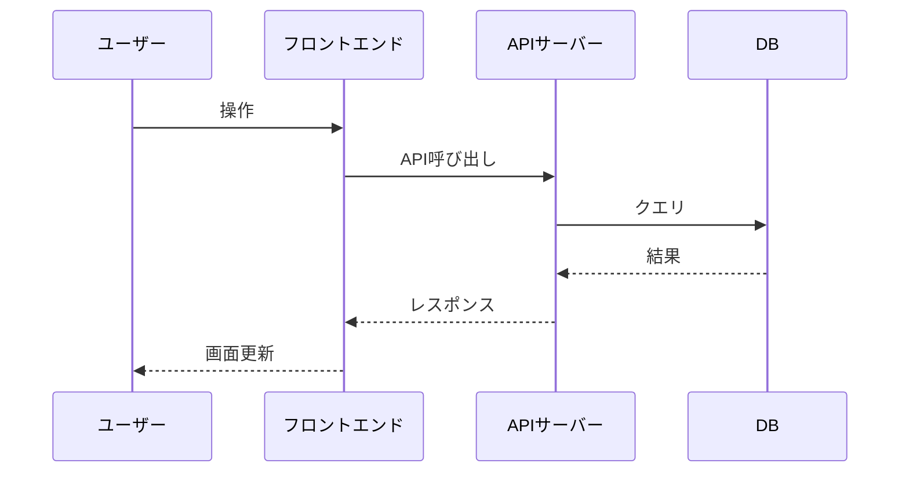
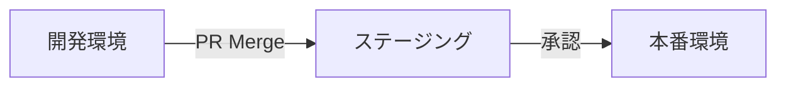

# アーキテクチャ設計書
プロジェクト名：
作成日：YYYY-MM-DD
バージョン：1.0

## システム概要図

## コンポーネント一覧
| コンポーネント | 技術 | 役割 | スケーリング方針 |
|-------------|------|------|-------------|
| フロントエンド | | | |
| APIサーバー | | | |
| データベース | | | |
| キャッシュ | | | |
| 認証 | | | |

## データフロー図

## 技術スタック選定理由
| 技術 | 採用理由 | 代替案 | 却下理由 |
|-----|---------|-------|---------|
| | | | |

## 非機能要件の対応方針
| 要件 | 方針 | 実装方法 |
|-----|------|---------|
| 可用性 | | |
| スケーラビリティ | | |
| セキュリティ | | |
| パフォーマンス | | |

## デプロイ構成

