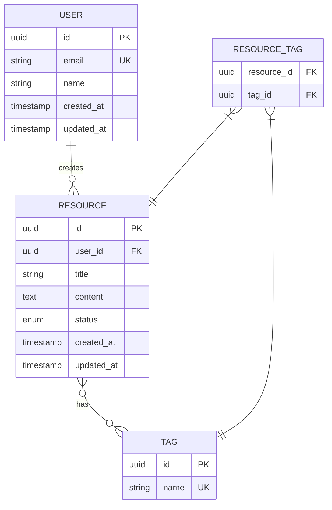

# ER図
プロジェクト名：
作成日：YYYY-MM-DD

## エンティティ関係図

## テーブル定義
### users
| カラム名 | 型 | 制約 | 説明 |
|---------|---|------|------|
| id | UUID | PK, NOT NULL | |
| email | VARCHAR(255) | UNIQUE, NOT NULL | |
| name | VARCHAR(100) | NOT NULL | |
| created_at | TIMESTAMP | NOT NULL | |
| updated_at | TIMESTAMP | NOT NULL | |

### （各テーブルを同形式で追加）

## インデックス設計
| テーブル | カラム | 種別 | 理由 |
|---------|-------|------|------|
| | | | |
