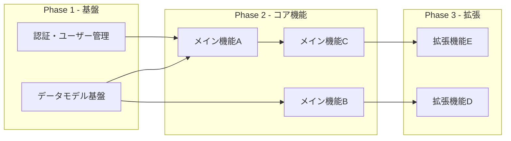

# 機能依存関係グラフ
プロジェクト名：
作成日：YYYY-MM-DD

## 依存関係図

## 機能一覧（優先度付き）
| 機能ID | 機能名 | フェーズ | 依存機能 | 工数目安 | 備考 |
|-------|-------|---------|---------|---------|------|
| F001 | 認証・ユーザー管理 | 1 | なし | M | |
| F002 | データモデル基盤 | 1 | なし | S | |
| F003 | メイン機能A | 2 | F001,F002 | L | |

## 並列開発可能グループ
| グループ | 機能 | 前提 |
|---------|------|------|
| Group A | F001, F002 | なし（初期から着手可能）|
| Group B | F003, F004 | Group A完了後 |
| Group C | F005, F006 | Group B完了後 |
